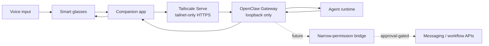

# OpenClaw Wearables

Secure **Bring Your Own Agent (BYOA)** integration patterns for smart glasses and
wearable devices. The first validated implementation connects Even G2 to OpenClaw;
the architecture is designed to extend to Meta Ray-Ban and other device surfaces.

## Why this matters

Wearables reduce the friction between an intention and a digital action. The useful
engineering challenge is not merely putting an LLM behind a microphone; it is
building a path that remains private, observable, recoverable, and safe when it can
eventually trigger external actions.

Potential business applications include:

- hands-free field service and inspection assistance;
- accessibility and low-friction knowledge retrieval;
- just-in-time workflow guidance for frontline teams;
- meeting notes, reminders, and approval-gated communication;
- portable agent access across multiple hardware vendors.

## Current status

| Capability | Status | Evidence |
|---|---|---|
| Even G2 voice → OpenClaw → glasses display | Validated | Real-device Chinese request and response |
| Tailnet-only HTTPS transport | Validated | Private Serve route; no Funnel or public port |
| Endpoint authentication | Validated | Unauthorized request rejected with HTTP 401 |
| Restart persistence | Validated | Gateway restart followed by successful checks |
| Multi-user LINE isolation | Validated | Owner and guest messages reached separate agents and sessions |
| Continuous G2 conversation context | Planned | Current client requests create independent sessions |
| Approval-gated outbound messaging | Planned | Requires recipient/content preview before send |
| Narrow-permission wearable bridge | Planned | Replaces the high-privilege gateway token on devices |

Last evidence review: **2026-09-14**.

## Architecture



The gateway listens only on loopback. Tailscale Serve terminates private HTTPS and
proxies requests from authenticated tailnet devices. Application authentication is
still required, creating two independent controls: network membership and a bearer
credential.

## Engineering decisions

1. **Use the vendor-supported BYOA path first.** It minimizes latency and integration
   points while proving the end-to-end user experience.
2. **Keep the gateway off the public Internet.** Tailnet-only access limits exposure
   before a narrow bridge exists.
3. **Separate conversation from external action.** Answering a question is reversible;
   sending a message or changing data needs a preview and explicit confirmation.
4. **Treat fallback as a reliability feature, not a quality downgrade.** Models in an
   automatic fallback chain must still satisfy tool-safety and context requirements.
5. **Isolate users at both session and agent layers.** Admission control alone does not
   separate memory, files, or tool authority.

Detailed rationale is recorded in [docs/DECISIONS.md](docs/DECISIONS.md).

## Validation approach

The project distinguishes configuration evidence from user-flow evidence:

- **positive path:** authenticated request reaches the intended agent;
- **negative path:** unauthenticated request is rejected;
- **network boundary:** service remains loopback-only and tailnet-only;
- **persistence:** checks run again after gateway restart;
- **hardware path:** a spoken request is rendered back on the physical glasses;
- **routing isolation:** fresh messages from two users land in different agent/session stores.

Run the non-secret local checks with:

```sh
./scripts/preflight.sh
```

The script reports capability state without printing tokens or full configuration.

## Known limitation: session continuity

The OpenAI-compatible Chat Completions endpoint creates a new session when the
client does not provide a stable conversation identity. The tested Even client did
not provide one, so follow-up questions may not inherit short-term context.

A future bridge can assign a conversation-scoped identifier with an explicit expiry.
It should not bind every request to one permanent account-level session, which would
mix unrelated conversations and grow context without a lifecycle boundary.

## Security model

- Never commit API keys, gateway tokens, device identifiers, chat content, or raw
  OpenClaw configuration.
- Use placeholders such as `https://<device>.<tailnet>.ts.net/v1/chat/completions`.
- Keep high-privilege credentials only on trusted devices and private transport.
- Introduce a narrow bridge before supporting additional users or external actions.
- Show recipient and content on the wearable before irreversible communication.
- Grant guest agents only the workspace, memory, and tools required for guest chat.

See [SECURITY.md](SECURITY.md) and the latest
[publication audit](docs/PUBLICATION_AUDIT.md).

## Learning path

[docs/LEARNING.md](docs/LEARNING.md) explains the reusable concepts behind the
implementation: BYOA, API endpoints, reverse proxies, bearer authentication,
Tailscale Serve vs. Funnel, model fallback, session routing, least privilege, and
acceptance testing.

## Roadmap and measurable outcomes

- measure median and p95 voice-to-display latency;
- classify failures by network, authentication, model, and device layer;
- add conversation-scoped session continuity;
- build a narrow-permission bridge with rate limits and structured logs;
- add approval-gated LINE communication;
- evaluate a second wearable platform using the same gateway contract.

## Repository map

- [docs/LEARNING.md](docs/LEARNING.md) — protocols and engineering concepts
- [docs/DECISIONS.md](docs/DECISIONS.md) — architecture decision records
- [docs/PORTFOLIO.md](docs/PORTFOLIO.md) — business case and evidence model
- [docs/PUBLICATION_AUDIT.md](docs/PUBLICATION_AUDIT.md) — privacy/security release gate
- [SECURITY.md](SECURITY.md) — contribution and disclosure boundaries
- [scripts/preflight.sh](scripts/preflight.sh) — non-secret local validation

## References

- [Even: Bridging G2 to OpenClaw](https://support.evenrealities.com/hc/en-us/articles/16280926743695-Tutorial-Bridging-G2-to-OpenClaw-Bring-Your-Own-Agent)
- [Even Hub Quickstart](https://hub.evenrealities.com/docs/get-started/quickstart/index)
- [Even Hub Device APIs](https://hub.evenrealities.com/docs/build/device-apis)
- [Even Hub templates](https://github.com/even-realities/evenhub-templates)
- [OpenClaw Chat Completions API](https://docs.openclaw.ai/gateway/openai-http-api)
- [OpenClaw Tailscale guide](https://docs.openclaw.ai/gateway/tailscale)

## License and trademarks

Released under the [MIT License](LICENSE). Product and company names are used only
to describe interoperability; their respective owners retain all trademark rights.
