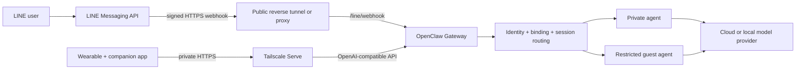
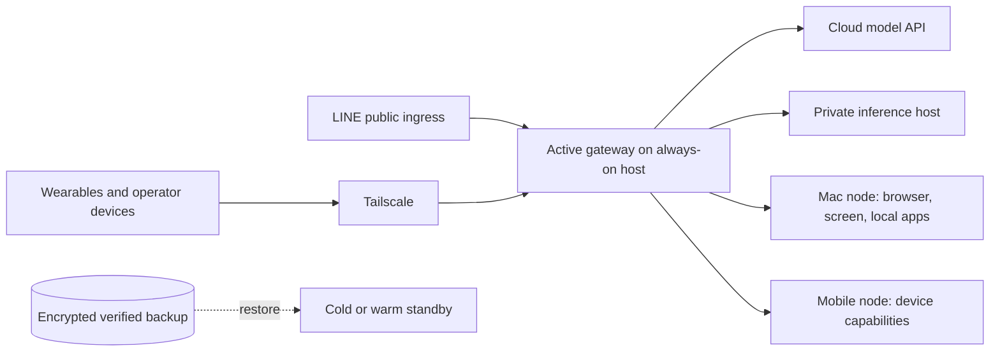

# Ingress, deployment, and migration architecture

This note separates channel ingress, wearable API traffic, private device access,
and the agent runtime. The same components may share a host during development,
but they solve different problems.

## Two ingress paths, one gateway

| Component | Purpose | LINE | Wearable BYOA |
|---|---|---:|---:|
| Gateway | Authentication, routing, sessions, agents, tools, model calls | Yes | Yes |
| Webhook | Lets LINE push new events to the system | Required | No |
| Public reverse tunnel/proxy | Gives LINE Cloud a reachable HTTPS endpoint | Required for a local gateway | Optional and usually undesirable |
| Tailscale | Private encrypted connectivity between approved devices | Not usable by LINE Cloud | Recommended for private BYOA and operator access |
| OpenAI-compatible API | Request/response contract used by a companion app | No | Required by the validated client path |

The public and private ingress paths should not be confused. LINE servers cannot
join a personal tailnet, while a personal wearable does not need broad public
exposure when its companion phone can join the tailnet.

## What each infrastructure term means

### Gateway

The gateway is the authoritative runtime entry point. It receives channel events or
API requests, authenticates them, selects an agent and session, invokes models and
tools, and returns a result. It is more sensitive than a single-purpose endpoint
because it coordinates many capabilities.

### Webhook

A webhook is an event-delivery contract, not a hosting product. LINE sends an HTTPS
`POST` to `/line/webhook`; the LINE plugin verifies the request signature and handles
redelivery. A webhook needs a public HTTPS route when the sender is an Internet
service.

### ngrok or another public tunnel

A reverse tunnel creates an outbound connection from the gateway host to a public
edge and forwards selected inbound requests back to the local service. It avoids
router port forwarding, but the resulting endpoint is still Internet reachable.
Use a stable domain, signature verification, rate limits, monitoring, and the
narrowest possible path for long-lived operation.

Running only the tunnel agent on a VPS while forwarding to a laptop does not remove
the laptop as a failure dependency. Availability improves only when the authoritative
gateway and its required state also run on an always-on host, or when a tested
standby can take over.

### Tailscale and Tailscale Serve

Tailscale creates an encrypted private overlay network. Serve terminates HTTPS for
tailnet members and can forward to a loopback-only gateway. It is useful for a
companion phone, Control UI, and nodes. Tailscale Funnel is different: it deliberately
publishes a service to the Internet and needs a public-ingress threat model.

## Evolution path

### Stage 1 — Personal development

- One Mac runs the gateway, agents, sessions, and tools.
- A public tunnel serves only the LINE webhook.
- Tailscale provides private wearable and operator access.
- Cloud models or a local model provide inference.

This is adequate while downtime during laptop sleep, upgrades, or network changes is
acceptable.

### Stage 2 — Stable always-on control plane

- Move the single active gateway to a small always-on VPS or home server.
- Terminate LINE public ingress on that host with a stable domain.
- Keep the Mac and future computers as paired nodes over Tailscale.
- Keep model inference replaceable: cloud API, local GPU service, or both.
- Add health checks, log retention, encrypted verified backups, and alerting.

The VPS does not need a GPU merely to run the gateway. Allocate GPU compute only when
latency, privacy, cost, or offline operation justifies hosting a model locally.

### Stage 3 — Hybrid cloud and edge

Use one active gateway as the source of truth. A standby should remain inactive until
cutover, because two independent webhook consumers can create duplicate replies and
divergent sessions.

## Adding devices and agents

More devices do not automatically require more agents.

- Add a **device/client identity** when another phone, wearable, or computer connects.
- Add a **session identity** when conversations must not share short-term context.
- Add an **agent** when instructions, memory, workspace, model policy, or tool
  authority must differ.
- Add a **node** when the gateway must call capabilities physically located on
  another trusted computer or phone.
- Add another **gateway** only for hard isolation, a separate administration domain,
  or tested disaster recovery.

Every device should receive a narrow credential, explicit agent/session routing, an
expiry or revocation path, and auditable tool authority. A shared gateway master token
should not become the permanent credential for every wearable.

## Transfer to a new machine

1. Inventory the OpenClaw version, agents, workspaces, plugins, channels, model
   providers, ingress routes, nodes, and external DNS/webhook settings.
2. Create and verify a backup with `openclaw backup create --verify`, then encrypt it
   before copying it to backup storage. The archive contains credentials and session
   state, so handle it as a secret.
3. Install the same OpenClaw version on the new host and restore the archive to a
   fresh staging directory with `openclaw backup restore`.
4. Restore Git-backed project workspaces from their repositories; reconcile private
   workspace files and secret references separately.
5. Start the new gateway behind a temporary private or test ingress. Validate config,
   agent routing, memory search, model fallback, channel signature verification,
   BYOA authentication, node pairing, and restart persistence.
6. Stop the old active gateway before changing the LINE webhook or stable ingress to
   the new host.
7. Run end-to-end tests, retain the old host powered off as a rollback target for a
   defined window, then rotate any credentials exposed during migration.

Backups prove recoverability only after a restore rehearsal. Git protects public
project artifacts but does not replace encrypted backup of configuration, credentials,
sessions, and private workspace state.

## Reliability priorities

1. Stable ingress name and monitored tunnel/proxy.
2. Gateway service supervision and health checks.
3. Verified encrypted backups plus restore rehearsal.
4. Narrow credentials, signed webhooks, and per-device revocation.
5. Primary/fallback model validation.
6. Active-passive cutover runbook.
7. Only then consider horizontal or active-active designs.

The first production improvement should be an always-on gateway and a rehearsed
restore, not a second simultaneously active gateway.

## Primary references

- [OpenClaw LINE channel](https://docs.openclaw.ai/channels/line)
- [OpenClaw Tailscale integration](https://docs.openclaw.ai/gateway/tailscale)
- [OpenClaw remote gateways and nodes](https://docs.openclaw.ai/help/faq/remote-gateways-and-nodes)
- [OpenClaw backup CLI](https://docs.openclaw.ai/cli/backup)
